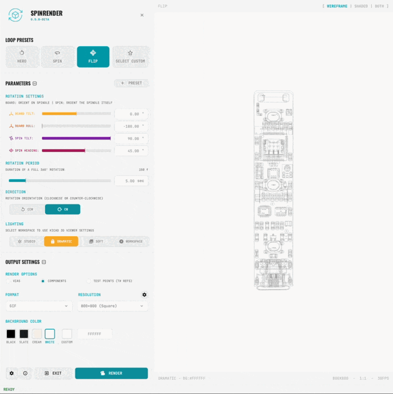

# 

#### **Easy hero animations for your nerdy KiCad PCBs**

SpinRender is a KiCad 9+ plugin for generating high-fidelity, social-media-ready looping 3D renders of your circuit boards. 

Use presets, or precisely control how your board rotates.

Give your board dramatic lighting to add wow to your presentation or have it well lit and use it as a pseudo-3D reference model on your phone.

<table align="center" style="width:100%; table-layout:fixed; border-collapse:collapse; border:none; padding:0; margin:0;">
   <tr style="border:none">
      <td style="width:33%; padding:0; margin:0; border:none;">
         
      </td>
      <td style="width:33%; padding:0; margin:0; border:none;">
         
      </td>
      <td style="width:33%; padding:0; margin:0; border:none;">
         
      </td>
   </tr>
</table>

<h2 style="color:#00BCD4; border-bottom: none !important; padding-top: 20px;">Features</h2>
<table style="width:100%; table-layout:fixed; border-collapse:collapse; border:none; padding:0; margin:0;">
   <tr style="border:none">
      <td style="width:30%; border:none;"><strong>Easy Button</strong></td>
      <td style="border:none;">Two-click, no-fuss, no-skills-required renders.</td>
   </tr>
   <tr style="border:none">
      <td style="width:30%; border:none;"><strong>Spin Precision</strong></td>
      <td style="border:none;">Control the speed and direction of your spin to the 0.01°.</td>
   </tr>
   <tr style="border:none">
      <td style="width:30%; border:none;"><strong>Flexible Staging</strong></td>
      <td style="border:none;">Personalize the background and control how your board is lit.</td>
   </tr>
   <tr style="border:none">
      <td style="width:30%; border:none;"><strong>Format Options</strong></td>
      <td style="border:none;">Export to an MP4 movie file, animated GIF, or lossless PNG sequence.</td>
   </tr>
</table>

<h2 style="color:#00BCD4; border-bottom: none !important; padding-top: 20px;">Installation</h2>

#### Requirements

>**KiCad 9.0 or 10.0**
>
>

>  
<strong>Fonts & Libraries</strong>

>
>   SpinRender will attempt to download and install the following Python packages and fonts on first launch:
>
>   **Python Packages:**
>   - `PyOpenGL`
>   - `PyYAML`
>   - `trimesh`
>   - `numpy`
>
>   **Fonts:**
>   - `JetBrains Mono`
>   - `Material Design Icons`
>   - `Oswald`
>
>   If you experience font rendering issues, ensure your system allows Python to access the internet, or manually install the recommended fonts listed above. For manual installation instructions, see the documentation.
>

#### Setup
>

>   
<strong>Using PCM</strong> (Recommended)

>
>1. Start KiCad and click on <strong>Plugin and Content Manager</strong> in the project window.
>2. Under <strong>Plugins</strong>, filter for <strong>SpinRender</strong>.
>3. Click <strong>Install</strong>.
>4. Click <strong>Apply Pending Changes</strong>.
>

>
>

>
>   
<strong>Release Download</strong>

>
>1. Download the latest release from <strong>Releases</strong>.
>2. In PCB Editor, go to <code>Tools &gt; External Plugins &gt; Reveal Plugin Folder ..</code>
>3. Unzip and drag the <strong>SpinRender</strong> folder into the revealed folder.
>

>
>

>   
<strong>Clone Repository</strong>

>
>1. Run <code>git clone https://github.com/alsoknownasfoo/SpinRender</code>
>2. Run the install script:
>    - <strong>Windows:</strong> <code>install.bat</code>
>    - <strong>macOS/Linux:</strong> <code>install.sh</code>
>

#### Run
>1. Restart KiCad and open PCB Editor
>
> 
>
>2. Find the **SpinRender** icon in top toolbar or under `Tools > External Plugins`.

<h2 style="color:#00BCD4; border-bottom: none !important; padding-top: 20px;">Usage</h2>
Coming..

<h2 style="color:#00BCD4; border-bottom: none !important; padding-top: 20px;">Troubleshooting</h2>

   
<strong>Missing Toolbar Icon</strong>
 

   - Ensure you installed to the correct plugin folder for your KiCad version and platform.

   - Restart KiCad after installation.

   - Check the plugin manager for errors or missing dependencies.

   
<strong>Missing dependencies:</strong>
 

  * Open a terminal and run the manual install command above.

  * Verify your Python version matches the one bundled with KiCad.

   
<strong>Permission errors:</strong>
 

  - On macOS/Linux, you may need to run `chmod +x install.sh` before executing the install script.

  - On Windows, run the installer as administrator if you encounter access issues.

#### Still stuck?
Open an issue on GitHub with your OS, KiCad version, and any error messages.

<h2 style="color:#00BCD4; border-bottom: none !important; padding-top: 20px;">Contributing</h2>

Built with support from: [^1]
[^1]:So there might be some wonky code.
<table>
   <tr style="border: none;">
      <td align="center" style="border: none;>
         <a href="https://claude.ai/" title="Claude">
             
         </a>
      </td>
      <td align="center" style="border: none;>
         <a href="https://gemini.google.com/" title="Gemini">
             
         </a>
      </td>
      <td align="center" style="border: none;>
         <a href="https://chatgpt.com/" title="ChatGPT">
             
         </a>
      </td>
      <td align="center" style="border: none;>
         <a href="https://github.com/features/copilot" title="Copilot">
             
         </a>
      </td>
      <td align="center" style="border: none;>
         <a href="https://stepfun.ai/" title="StepFun">
             
         </a>
      </td>
   </tr>
</table>

**Bug Reports:** Open a GitHub issue.  
**Feature Requests:** Submit via GitHub discussions.

_All feedback and suggestions welcomed!_

<h2 style="color:#00BCD4; border-bottom: none !important; padding-top: 20px;">License</h2>

SpinRender is released under the **GPLv3 License**. See `LICENSE` for details.

<h2 style="color:#00BCD4; border-bottom: none !important; padding-top: 20px;">Thank You!</h2>

Thanks for taking the time to check this project.  
I created it because I wanted a way to show people how beautiful PCB design can be.   

Hopefully, it helps you do the same.  

<table style="padding-top: 25px; table-layout:fixed; border-collapse:collapse; border: none">
<tr style="padding:0; margin:0; border: none">
<td style="padding:0; margin:0; border: none">

</td>
<td style="width: 20px; padding:0; margin:0; border: none">
</td>
<td style="padding:0; margin:0; border: none">

</td>
</tr>
</table>